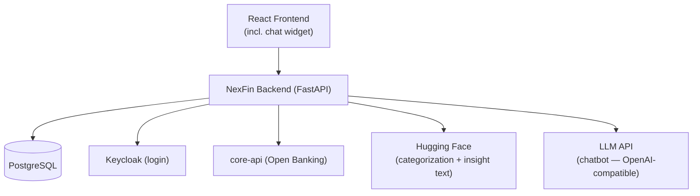
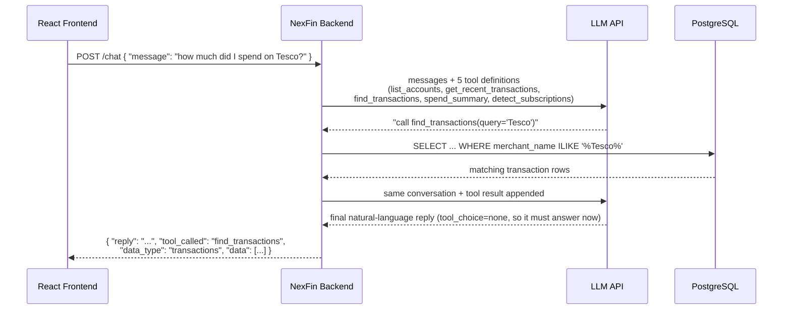

# Architecture

A React client talks to one FastAPI backend, which is the only thing that touches the database or calls out to external services: Keycloak for login, the bank's core-api for account data, and **two separate LLM integrations** — Hugging Face for transaction categorization/narrative insights, and a second, independently-configured OpenAI-compatible LLM (works with OpenAI, Groq, Gemini, or a local Ollama) for the conversational chatbot.



**[View the interactive diagram →](https://claude.ai/code/artifact/5bb54336-24fb-4665-b067-7762e60242dc)** and **[backend-only, one level down →](https://claude.ai/code/artifact/ee3c6cad-07eb-43cf-a4c7-9491f613a206)** — both include the chatbot/LLM addition below.

## The chatbot

`POST /chat` (`{message, account_id?}`) is a **tool-calling** conversation, not a plain Q&A — the LLM never answers from its own knowledge, it can only report what a tool actually returns from the database:



Five tools, all reading the synced Postgres data only (never core-api directly, same as `/analysis/*`/`/insights/*`):

| Tool | Answers questions like | Reads |
|---|---|---|
| `list_accounts` | "what accounts do I have?" | `accounts` table |
| `get_recent_transactions` | "recent transactions", "what did I spend lately" | latest `transactions`, newest first |
| `find_transactions` | "did I pay Netflix?", "find my rent payments" | `transactions` filtered by merchant/description text |
| `spend_summary` | "how much did I spend this month?" | one month's transactions, totaled by category/merchant |
| `detect_subscriptions` | "what am I paying monthly?" | recurring same-merchant, similar-amount debits over a lookback window |

The system prompt enforces two hard rules worth knowing: it must call a tool before stating any figure (never invent numbers), and it refuses anything outside the user's own account/transaction/spending data — no payments, no general knowledge, no advice. The frontend renders the `data`/`data_type` returned alongside the reply as a structured card (transaction rows, account list, etc.) rather than the LLM re-describing it in prose.

**Wired into the UI:** `ChatWidget.jsx`, mounted globally in `DashboardLayout.jsx` — available on every dashboard page, not scoped to one route.

## Example — calling `GET /analysis/monthly-spending`

This one never touches core-api directly, only Postgres, which is why it's fast even though it returns computed results, not raw pass-through data:

```mermaid
sequenceDiagram
    participant C as React Frontend
    participant B as NexFin Backend
    participant DB as PostgreSQL

    C->>B: GET /analysis/monthly-spending<br/>Authorization: Bearer &lt;token&gt;
    B->>DB: SELECT transactions for this user's accounts
    DB-->>B: rows (amount, category, date, ...)
    Note over B: group by month, split spend vs income,<br/>total by category/merchant/account
    B-->>C: 200 OK
    Note over C: [{ "month": "2026-07",<br/>"total_spend": 2242.00,<br/>"total_income": 2000.00,<br/>"by_category": [...] }]
```

For the logic behind this and every other endpoint, see [ENDPOINTS.md](ENDPOINTS.md) (plain-language) or [CALCULATIONS.md](CALCULATIONS.md) (with fields used and a full worked numeric example). For which frontend page calls which endpoint, see [FRONTEND_ENDPOINTS.md](FRONTEND_ENDPOINTS.md). For the code-level implementation, see [python-backend/WIKI.md](python-backend/WIKI.md).
