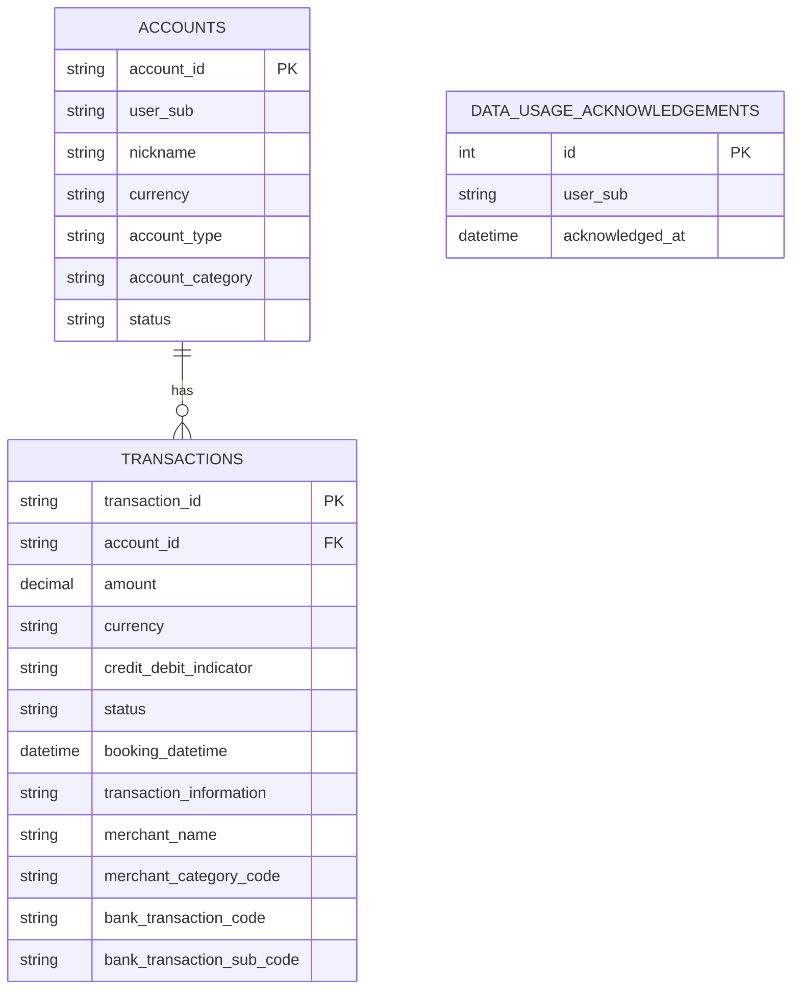

# Data Handling & Privacy Plan

NexFin pulls account and transaction data from an Open Banking (AISP) provider on behalf of a customer (PSU — Payment Services User) to run **monthly spending analysis** (spend totals, category breakdown, merchant breakdown, per month). This document is the plan for doing that legally and sets the shape of what's stored in the database. Everything here is scoped tightly to that one named purpose — anything that doesn't serve it is deliberately left out, not stored "just in case."

## Legal basis

Two frameworks apply, and both have to be satisfied independently:

- **PSD2 / Open Banking (UK)** — gives NexFin the right to *access* the data, but only as an AISP acting on explicit PSU consent, scoped to specific accounts and a specific purpose.
- **UK GDPR** — governs what NexFin does with the data once it has it (storage, processing, deletion). Consent under PSD2 does not by itself satisfy GDPR — GDPR's lawful basis here is also consent (Art. 6(1)(a)).

Consent capture/tracking (the PSD2 90-day re-consent cycle, revocation handling, a `consents` table) is **out of scope for this phase** — noted here so it isn't forgotten, but not something we're building right now.

## Data model

| Table | Purpose | Fields |
|---|---|---|
| `accounts` | Which accounts belong to which user, and enough metadata to segment/label spending by account | `account_id` (PK), `user_sub` (FK to the owning PSU — not a consent record, just ownership), `nickname` (presentation only — labels a spend breakdown for the user, not used in the computation itself), `currency`, `account_type`, `account_category`, `status` |
| `transactions` | Line items the monthly spend/category/merchant totals are computed from | `transaction_id` (PK), `account_id` (FK), `amount`, `currency`, `credit_debit_indicator` (isolates debits as spend, excludes credits/refunds), `status` (pending transactions — `PDNG` — are included in totals but broken out separately as `pending_spend`/`pending_income`, since they can still change or reverse and shouldn't be silently indistinguishable from settled amounts), `booking_datetime` (buckets into months), `transaction_information` (presentation only — what a line item was, for drill-down), `merchant_name`, `merchant_category_code` (the actual spend-by-category field), `bank_transaction_code`/`bank_transaction_sub_code` (distinguishes real spend from internal transfers) |

`DATA_USAGE_ACKNOWLEDGEMENTS` stands alone — keyed by the token's `user_sub`, not linked to a specific account, since it's just "has this person seen the notice." The scaffold `items` table from the initial project setup isn't part of this domain and is omitted here.

### Not stored, and why

**Not needed for monthly spending analysis specifically** (would need their own named purpose to justify storing):
- **The whole `balances` table / any balance snapshot** — that's for balance-trend or net-worth tracking, a different feature. Monthly spend/category/merchant totals are computed entirely from `transactions`.
- **`balance_after_amount`/`balance_after_currency`** on transactions — same reason, that's for reconstructing balance history.
- **`opening_date`, `maturity_date`, `international_account`** on accounts — these serve account-tenure, investment-horizon, or domestic/international-split analysis, none of which is monthly spending analysis.

**Excluded outright, real PII with no analytic value regardless of purpose:**
- The nested `Account[]` block (`LEI`, `Name`, `SchemeName`, `Identification`, `SecondaryIdentification`) — the account holder's name plus full sort-code/account-number.
- `Servicer` (branch/bank identifiers), `StatementFrequencyAndFormat`/`DeliveryAddress` (postal address), `SwitchStatus`, `StatusUpdateDateTime`.
- `CreditorAgent`/`DebtorAgent`/`UltimateCreditor`/`UltimateDebtor`/`CreditorAccount`/`DebtorAccount` on transactions (BICs, postal addresses).
- `ProprietaryBankTransactionCode` (redundant once `BankTransactionCode` is captured), `CardInstrument`, `PaymentPurposeCode` (overlaps with `BankTransactionCode`/MCC).
- On balances (if that table is ever built for a separately-justified purpose): `LocalAmount` (FX-converted duplicate of `Amount`) and `TotalValue` (semantics unclear from sample data, doesn't reconcile cleanly).

**Notes:**
- `TransactionReference` isn't reliably unique per transaction (the mock API can reuse the same reference across distinct transactions), so it can't be used as a dedup key — `TransactionId` is the sole identifier.
- `category` isn't a field OBIE actually provides — it's derived from `merchant_category_code`, computed at query time rather than stored as if the bank supplied it.

The OAuth access/refresh tokens themselves are never persisted — the backend only proxies the bearer token per-request, and that stays true with storage added: the sync job takes a bearer token as input to call core-api, and doesn't write it anywhere.

## GDPR principles → how they're implemented

- **Purpose limitation** — every stored field maps to monthly spending analysis specifically (see table above). Nothing is stored on the basis of "might be useful later."
- **Transparency** — implemented as a one-time notice shown to the PSU the first time they log in, explaining what's stored and why, with an explicit "I understand / agree" confirmation before they proceed. Already implemented (`data_usage_acknowledgements` table, `/me/notice` endpoints) — lighter than a full PSD2 consent record, just an acknowledgement.
- **Data minimisation** — only the fields listed above; no raw OBIE JSON blobs persisted wholesale.
- **Security** — secrets live in env vars, not code (`.env`, gitignored). Once the DB holds real customer data: enforce TLS to Postgres, restrict the DB role to least privilege, encrypt the volume at rest in any non-local deployment, and log access so it's auditable who/what queried a given customer's records.
- **Storage limitation (retention)** — transactions get a retention window (default proposal: 13 months — confirm or change).

## Open questions

- Retention period: 13 months proposed — confirm or change.
- Deletion mechanism for expired-retention data: hard delete vs. anonymise-in-place.

## Implemented

- `Account`/`Transaction` SQLAlchemy models (`app/models.py`)
- `POST /sync/accounts` — pulls the current user's accounts + all transactions from core-api and upserts them into the DB, scoped to the caller's `user_sub`
- `GET /analysis/monthly-spending` — reads the current user's stored transactions and returns per-month totals (spend, income, transaction count) plus category, merchant, and per-account breakdowns
- `GET /analysis/financial-health` — derived observations (spend-vs-income ratio, month-over-month trend, category concentration) computed at query time from the same stored transactions; nothing new is persisted for this feature

If balance-trend/net-worth tracking becomes a real feature later, it gets its own purpose statement and field list here — not folded into this one.
