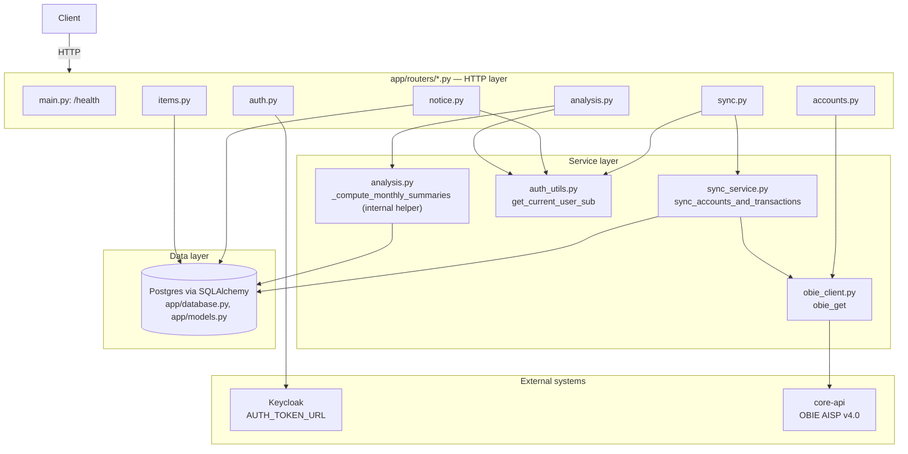

# NexFin Backend Wiki

Technical reference for every endpoint and the service layer underneath it. For *why* specific fields are stored (privacy/GDPR rationale), see [PRIVACY.md](../PRIVACY.md) — this document is about *how* the code works.

## Architecture



**Layering pattern:** routers hold no business logic beyond request/response shaping and auth dependencies — they delegate to the service layer (`obie_client`, `sync_service`, `auth_utils`, or an in-file helper for `analysis.py`). Two routers (`items.py`, `auth.py`) are simple enough that the router *is* the whole implementation — no separate service module was warranted.

### Config & database (`app/config.py`, `app/database.py`)

- `Settings` (`app/config.py`) is a `pydantic-settings` `BaseSettings` that reads `python-backend/.env`. Every external dependency's location/credentials live here: `database_url`, `cors_origins`, `auth_token_url`/`auth_client_id`/`auth_client_secret` (Keycloak), `core_api_base_url` (core-api). No secret is ever hardcoded in source.
- `app/database.py` creates the SQLAlchemy `engine`/`SessionLocal`/`Base` from `settings.database_url`, and exposes `get_db()` — a generator dependency that yields a session and always closes it, used by every router that touches Postgres.
- `app/main.py` calls `Base.metadata.create_all(bind=engine)` at import time — there's no migration tool (Alembic etc.) yet; schema changes require restarting the app, and it will not alter existing columns, only create missing tables.

---

## Endpoints

### Health — `app/main.py`

| | |
|---|---|
| `GET /health` | No auth. Returns `{"status": "ok"}`. Pure liveness check, no dependencies. |

### Auth — `app/routers/auth.py`

| | |
|---|---|
| `POST /auth/login` | No auth (this *is* the auth). Body: `{username, password}` (`schemas.LoginRequest`). |
| `POST /auth/refresh` | No auth. Body: `{refresh_token}` (`schemas.RefreshRequest`). |

**Shared helper — `_exchange_token(form: dict) -> dict`:** both routes POST a form body to `settings.auth_token_url` (Keycloak) via a fresh `httpx.AsyncClient(timeout=Timeout(30.0, connect=10.0))` and return the JSON response verbatim, validated against `schemas.TokenResponse` (`access_token`, `expires_in`, `refresh_token`, `refresh_expires_in`, `token_type`, `scope`). They differ only in the form body's `grant_type` and credentials:

- **`login`**: `grant_type=password` with `client_id`/`client_secret` (from `Settings`) plus the caller's `username`/`password`.
- **`refresh`**: `grant_type=refresh_token` with `client_id`/`client_secret` plus the caller's `refresh_token`. Keycloak issues a **new** access/refresh token pair each time — the old refresh token isn't reusable afterward, so the caller must persist whatever comes back, not the one it sent in.

**Errors:** `500` if `auth_token_url`/`auth_client_id` aren't configured; `504`/`502` if the request to Keycloak itself times out or fails to connect; `401` if Keycloak rejects the credentials or refresh token (any other non-200 from Keycloak is collapsed to a generic 401, not passed through raw — the message differs slightly: "Invalid credentials" for login, "Invalid or expired refresh token" for refresh).

**Background sync on login:** if `login` gets an `access_token` back, it schedules `_sync_after_login(db, authorization)` via FastAPI's `BackgroundTasks` — runs *after* the response is already sent to the client, so login latency is unaffected. That helper resolves the token's `sub` via `get_current_user_sub` and calls `sync_accounts_and_transactions` (same function `/sync/accounts` uses), wrapped in a bare `try/except Exception: pass` — a failed background sync must never surface as a broken login; the Insights page still does its own sync before reading analysis data as a safety net. `refresh` does not trigger this — only a fresh login does.

**Token storage:** the backend itself never persists an access or refresh token anywhere (not in Postgres, not in memory beyond the request/background-task that's using it). The client is expected to hold both and send the access token as `Authorization: Bearer <token>` on every subsequent request, calling `/auth/refresh` with the stored refresh token once the access token expires (5 minutes in this sandbox) rather than forcing a full re-login.

### Items — `app/routers/items.py`

Scaffold CRUD unrelated to the banking domain (left over from initial project setup — see root `README.md`). No auth, backed directly by the `items` table.

| | |
|---|---|
| `GET /items/` | Returns all rows (`schemas.ItemOut[]`). |
| `POST /items/` | Body: `schemas.ItemCreate` (`name`, `description?`). Inserts and returns the row, `201`. |
| `GET /items/{item_id}` | Returns one row or `404` if it doesn't exist. |

### Accounts — `app/routers/accounts.py` (thin proxy over `app/obie_client.py`)

All four routes require `Authorization: Bearer <token>` and do **no local processing** — they forward the header straight to core-api and return its JSON response unmodified. None of these read or write Postgres.

| | | |
|---|---|---|
| `GET /accounts?type=` | optional `type` query param (e.g. `domestic`) | → `GET {core_api_base_url}/api/obie-aisp/v4.0/accounts?type=...` |
| `GET /accounts/{account_id}` | | → `.../accounts/{account_id}` |
| `GET /accounts/{account_id}/balances` | | → `.../accounts/{account_id}/balances` |
| `GET /accounts/{account_id}/transactions?pageIndex=&pageSize=` | both optional | → `.../accounts/{account_id}/transactions?pageIndex=...&pageSize=...` |

**Service layer — `app/obie_client.py`:**

```python
async def obie_get(path: str, authorization: str, params: dict | None = None):
```

- Raises `500` up front if `core_api_base_url` isn't configured.
- Builds `{core_api_base_url}/api/obie-aisp/v4.0/accounts{path}` and does a single `httpx.AsyncClient().get(...)`, forwarding `Authorization` and `Accept: application/json`.
- Any non-200 from core-api is re-raised as an `HTTPException` with the **same status code and body** core-api returned (unlike `/auth/login`, this one does pass errors through transparently — e.g. an expired/invalid token surfaces whatever 401 core-api itself sends).
- This is the single choke point every OBIE call goes through — both the live proxy routes above and the sync service (below) call `obie_get` rather than making their own HTTP calls.

### Notice — `app/routers/notice.py`

The "first-login data usage notice" acknowledgement — see `PRIVACY.md` for why this exists and what it deliberately isn't (not a full PSD2 consent record). Backed by the `data_usage_acknowledgements` table (`account: user_sub` unique, `acknowledged_at`).

All three routes require `Authorization: Bearer <token>` and use `app/auth_utils.get_current_user_sub` (see below) to identify the caller — no other input.

| | Behavior |
|---|---|
| `GET /me/notice` | Looks up a row by `user_sub`. Returns `{acknowledged: false, acknowledged_at: null}` if none exists, else `{acknowledged: true, acknowledged_at: <timestamp>}`. |
| `POST /me/notice/ack` | Upsert: if no row exists, creates one (timestamp set by the column's `server_default=func.now()`); if one already exists, does nothing and returns the existing timestamp. **Idempotent** — calling it twice doesn't move the timestamp. |
| `DELETE /me/notice/ack` | Deletes the row if it exists (no-op if it doesn't). Always returns `{acknowledged: false, acknowledged_at: null}`. Idempotent. |

### Sync — `app/routers/sync.py` (thin wrapper over `app/sync_service.py`)

| | |
|---|---|
| `POST /sync/accounts` | `Authorization: Bearer <token>` required. No body. |

The router itself is three lines: resolve `user_sub` via `get_current_user_sub`, call `sync_accounts_and_transactions(db, user_sub, authorization)`, return its result as `schemas.SyncResult` (`{accounts_synced, transactions_synced}`).

**Service layer — `app/sync_service.py`:**

```python
async def sync_accounts_and_transactions(db: Session, user_sub: str, authorization: str) -> dict:
```

Step by step:
1. Calls `obie_get("", authorization, {"type": "domestic"})` — same call the `/accounts` proxy route makes — to get the account list.
2. For each account in the response:
   - **Upsert into `accounts`**: `db.get(models.Account, account_id)`; if missing, creates a new row; either way, overwrites `user_sub`, `nickname`, `currency`, `account_type` (from `AccountTypeCode`), `account_category`, `status` from the fresh API response. This means **re-running sync always overwrites with the latest core-api data** — there's no conflict resolution because there's only one source of truth (core-api) and no local edits are possible.
   - **Paginates through all transactions for that account**: loops `obie_get(f"/{account_id}/transactions", authorization, {"pageIndex": n, "pageSize": 100})`, incrementing `pageIndex` until `pageIndex * 100 >= total` (from the response's `Data.Pagination.total`) or a page comes back empty. This is why `/sync/accounts` can take noticeably longer than a single `/accounts/*` proxy call — it's making `1 + sum(ceil(transaction_count / 100) per account)` requests to core-api sequentially.
   - **Upserts each transaction** the same way (`db.get(models.Transaction, transaction_id)`, create-or-update), mapping fields exactly as documented in `PRIVACY.md`'s data model table (amount/currency from the nested `Amount` object, merchant fields from `MerchantDetails`, transaction-type fields from `BankTransactionCode`).
3. Single `db.commit()` at the very end — the whole sync is one transaction. If anything raises partway through (e.g. core-api errors on page 2 of a large account), **nothing synced so far is rolled back automatically by this code**, but since nothing was committed yet, the whole operation effectively rolls back when the session is closed on request teardown without an explicit commit.

`TransactionId` is the upsert key — chosen deliberately over `TransactionReference`, which the PRIVACY.md notes isn't reliably unique in this sandbox.

### Analysis — `app/routers/analysis.py`

Both routes require `Authorization: Bearer <token>` (via `get_current_user_sub`) and read **only from Postgres** — neither one calls core-api. They only see whatever `/sync/accounts` has already persisted, so a stale or empty sync means stale or empty analysis.

#### Shared internal helper: `_compute_monthly_summaries(db, user_sub)`

Not a route — a private function both endpoints below call, returning `list[schemas.MonthlySpendSummary]` **in ascending (oldest-first) month order** (each public endpoint decides its own display order from that).

Logic:
1. Loads all `Account` rows for `user_sub`, building an `{account_id: nickname}` map. Returns `[]` immediately if the user has no synced accounts.
2. Loads every `Transaction` row whose `account_id` is one of those accounts (no date filtering — this pulls everything ever synced).
3. Buckets transactions by `booking_datetime.strftime("%Y-%m")` into a `defaultdict`, accumulating per month:
   - `total_spend`/`total_income` — split by `credit_debit_indicator` (`Debit` → spend, else → income)
   - `pending_spend`/`pending_income` — same split, but only transactions where `status == "PDNG"` (these are a **subset** of the totals above, not excluded from them — see `PRIVACY.md` for why pending isn't silently dropped)
   - `by_category` — spend only, keyed by `merchant_category_code` (falls back to the literal string `"Uncategorised"` if null)
   - `by_merchant` — spend only, keyed by `merchant_name` (falls back to `"Unknown"`)
   - `by_account` — both spend and income, keyed by `account_id`, plus a per-account `transaction_count`
4. Converts each month's bucket into a `MonthlySpendSummary`, rounding every money figure to 2 decimals and sorting `by_category`/`by_merchant`/`by_account` descending by amount.

#### `GET /analysis/monthly-spending`

Returns `_compute_monthly_summaries(...)` **reversed** (newest month first) — this is the only difference from the raw helper output.

#### `GET /analysis/financial-health`

Calls the same helper (ascending order — needed so "previous month" lookups by index work), then for each month `i` derives up to three `HealthObservation` entries (`{type, severity, message}`, severity is `"good"`/`"info"`/`"warning"`), evaluated independently and appended in this order:

1. **`spend_vs_income`** (always present if there's any income or spend that month):
   - `total_income > 0`: `ratio = total_spend / total_income`. `ratio > 1` → `warning` ("exceeded income by N%"); `ratio > 0.8` → `info`; else → `good`.
   - `total_income == 0` but `total_spend > 0` → `warning` ("spending with no recorded income").
   - If both are `0`, this observation is skipped entirely (nothing to say).
2. **`trend`** (only when `i > 0` and the *previous* month had `total_spend > 0`, to avoid dividing by zero): `change = (this month's spend - prev month's spend) / prev month's spend`. `> 0.2` → `warning`; `< -0.2` → `good`. Between −20% and +20%, no trend observation is added at all (not even an "info" — a normal fluctuation isn't flagged).
3. **`concentration`** (only when `total_spend > 0` and `by_category` is non-empty): takes the single highest-spend category (`by_category[0]`, already sorted descending by the helper), computes its `share` of that month's `total_spend`. `share > 0.5` → `info`. No observation below that threshold.
4. If none of the above produced anything (e.g. a month with zero activity), a single fallback `{"type": "none", "severity": "info", "message": "No notable financial health signals this month."}` is appended so the response is never an empty list for a month that exists in the data.

Result is reversed at the end, same as `monthly-spending`, so both endpoints display newest-first.

---

## Service layer reference (quick index)

| File | Function | Called by |
|---|---|---|
| `app/obie_client.py` | `obie_get(path, authorization, params)` | `accounts.py` (all 4 routes), `sync_service.py` |
| `app/sync_service.py` | `sync_accounts_and_transactions(db, user_sub, authorization)` | `sync.py` |
| `app/auth_utils.py` | `get_current_user_sub(authorization)` | `notice.py`, `sync.py`, `analysis.py` |
| `app/routers/analysis.py` | `_compute_monthly_summaries(db, user_sub)` (private, not exported) | `monthly_spending()`, `financial_health()` in the same file |

### `get_current_user_sub` — how identity is resolved without full auth

```python
def get_current_user_sub(authorization: str = Header(...)) -> str:
```

Strips the `Bearer ` prefix and decodes the JWT **without verifying its signature** (`jwt.decode(token, options={"verify_signature": False})`), returning the `sub` claim. This is a deliberate, scoped-down shortcut: it's used only to know *whose* row to read/write in `data_usage_acknowledgements`/`accounts`/`transactions` — it is never used to authorize access to the actual banking data. That authorization always happens at core-api (via `obie_get`), which verifies the token independently on every real data call. Raises `401` if the header isn't `Bearer <token>` shaped, or if the token doesn't decode, or if it has no `sub` claim.

---

## Error handling conventions

| Status | When |
|---|---|
| `422` | FastAPI's automatic validation — most commonly a missing/malformed `Authorization` header (declared as a required `Header(...)`), or a malformed request body |
| `401` | `/auth/login` on bad credentials; `get_current_user_sub` on a malformed/unverifiable bearer token |
| `404` | `/items/{item_id}` when the row doesn't exist |
| `500` | `/auth/login` or any `/accounts/*`/`/sync/*` route when the relevant env var (`AUTH_TOKEN_URL`/`AUTH_CLIENT_ID` or `CORE_API_BASE_URL`) isn't set |
| passthrough | `/accounts/*` and (indirectly, inside sync) core-api errors are re-raised with core-api's original status code and body — the one place this backend intentionally leaks an upstream error verbatim |

## Data model quick reference

See `PRIVACY.md` for the *why* behind every field. Structurally:

- `items` — scaffold table, unrelated to the banking domain.
- `data_usage_acknowledgements` — `user_sub` (unique), `acknowledged_at`. Standalone, no FK.
- `accounts` — `account_id` (PK, the OBIE `AccountId`), `user_sub`, `nickname`, `currency`, `account_type`, `account_category`, `status`, `synced_at`.
- `transactions` — `transaction_id` (PK, the OBIE `TransactionId`), `account_id` (FK → `accounts.account_id`), `amount` (`Numeric(18,2)`), `currency`, `credit_debit_indicator`, `status`, `booking_datetime`, `transaction_information`, `merchant_name`, `merchant_category_code`, `bank_transaction_code`, `bank_transaction_sub_code`.

No migration tool is set up — `Base.metadata.create_all()` runs on every app start and only adds missing tables; it does not alter existing ones.
